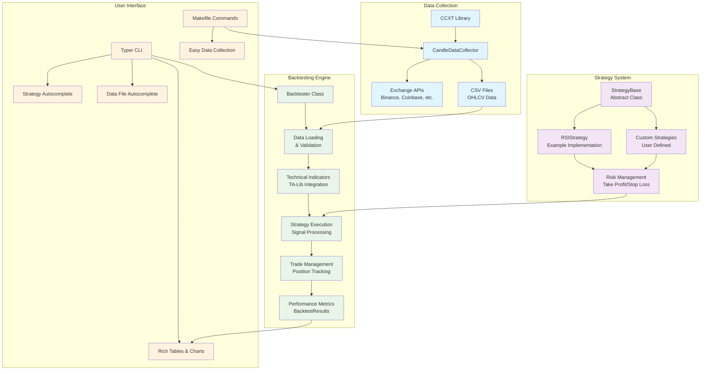

# =€ Cryptocurrency Backtesting Framework

A comprehensive, modular backtesting framework for cryptocurrency trading strategies with built-in data collection, risk management, and beautiful CLI interface.

## =Ë Table of Contents

- [Overview](#overview)
- [Architecture](#architecture)
- [Features](#features)
- [Installation](#installation)
- [Quick Start](#quick-start)
- [Components](#components)
  - [Backtester](#backtester)
  - [Data Collection](#data-collection)
  - [Strategy System](#strategy-system)
- [Usage Examples](#usage-examples)
- [Contributing](#contributing)

## <¯ Overview

This framework provides a complete solution for developing, testing, and analyzing cryptocurrency trading strategies. It combines:

- **Historical Data Collection** from major exchanges via CCXT
- **Flexible Strategy Development** with base classes and risk management
- **Comprehensive Backtesting Engine** with detailed performance metrics
- **Beautiful CLI Interface** with autocomplete and rich output
- **Modular Architecture** for easy extension and customization



## ( Features

### = Backtesting Engine
- **Dataclass-based Results** for type safety and clean data handling
- **Technical Indicators** powered by TA-Lib (RSI, SMA, etc.)
- **Performance Metrics** including Sharpe ratio, max drawdown, win rate
- **Trade Analysis** with detailed P&L tracking and position management
- **Equity Curve** generation and visualization support

### =Ê Data Collection
- **Multi-Exchange Support** via CCXT (Binance, Coinbase, Kraken, etc.)
- **Flexible Time Ranges** with custom start/end dates
- **Multiple Timeframes** (1m, 5m, 1h, 1d, etc.)
- **Rate Limiting** and error handling
- **CSV Export** with standardized OHLCV format

### >à Strategy System
- **Abstract Base Class** for consistent strategy development
- **Risk Management** with configurable take profit and stop loss
- **Position Tracking** for both long and short positions
- **Signal Generation** with custom indicator support
- **Extensible Architecture** for complex trading logic

### <¨ User Interface
- **Rich CLI** with beautiful tables and colored output
- **Autocomplete** for strategies and data files
- **Progress Tracking** with emojis and status indicators
- **Makefile Integration** for common tasks
- **Bash Completion** support

## =à Installation

```bash
# Clone the repository
git clone <repository-url>
cd backtester

# Install dependencies with uv (recommended)
uv sync

# Or with pip
pip install -r requirements.txt

# Install TA-Lib (required for technical indicators)
# On Ubuntu/Debian:
sudo apt-get install ta-lib-dev
# On macOS:
brew install ta-lib
# On Windows: download from https://www.lfd.uci.edu/~gohlke/pythonlibs/#ta-lib
```

## =€ Quick Start

### 1. Collect Data
```bash
# Using the CLI
uv run python data_collection/cli.py BTC/USDT -t 1h -s "2024-01-01" -e "2024-01-07"

# Or using Makefile
make collect SYMBOL=BTC/USDT TIMEFRAME=1h START=2024-01-01 END=2024-01-07
```

### 2. Run Backtest
```bash
# Using the main CLI with autocomplete
uv run python main.py run RSIStrategy data_collection/data/binance_BTC_USDT_1h_20240101_20240107.csv

# With custom parameters
uv run python main.py run RSIStrategy data.csv --capital 50000 --show-trades
```

### 3. View Results
```bash
# List available strategies
uv run python main.py list-strategies

# List available data files
uv run python main.py list-data

# Get framework info
uv run python main.py info
```

## =' Components

## Backtester

The core backtesting engine that processes historical data and executes trading strategies.

### Key Features:
- **Data Loading**: Automatic CSV parsing with timestamp handling
- **Indicator Calculation**: TA-Lib integration for technical analysis
- **Strategy Execution**: Signal processing and trade management
- **Performance Analysis**: Comprehensive metrics calculation
- **Results Export**: Structured data with BacktestResults dataclass

### Architecture:
```python
from backtester import Backtester
from strategy import RSIStrategy

# Initialize strategy
strategy = RSIStrategy(initial_capital=10000.0)

# Create backtester
backtester = Backtester(strategy)

# Run backtest
results = backtester.run('data/btc_usdt_1h.csv')

# Access results
print(f"Total Return: {results.total_return_pct:.2f}%")
print(f"Max Drawdown: {results.max_drawdown_pct:.2f}%")
```

### BacktestResults Structure:
```python
@dataclass
class BacktestResults:
    initial_capital: float
    final_value: float
    total_return_pct: float
    max_drawdown_pct: float
    total_trades: int
    winning_trades: int
    losing_trades: int
    win_rate_pct: float
    avg_win: float
    avg_loss: float
    equity_curve: pd.DataFrame
    trades: pd.DataFrame
```

## Data Collection

A powerful data collection system built on CCXT for gathering historical cryptocurrency data.

### Key Features:
- **Multi-Exchange Support**: Binance, Coinbase, Kraken, and 100+ exchanges
- **Flexible Timeframes**: From 1-minute to monthly candles
- **Date Range Selection**: Custom start and end times
- **Rate Limiting**: Built-in exchange rate limiting
- **Error Handling**: Robust error handling and retry logic
- **CSV Export**: Standardized OHLCV format

### Usage:
```python
from data_collection import CandleDataCollector

# Initialize collector
collector = CandleDataCollector('binance')

# Collect data
df = collector.collect_candles(
    symbol='BTC/USDT',
    timeframe='1h',
    start_time='2024-01-01',
    end_time='2024-01-07'
)

# Save to CSV
collector.save_to_csv(df, 'BTC/USDT', '1h', 'data/')
```

### CLI Interface:
```bash
# Basic collection
python data_collection/cli.py BTC/USDT -t 1h

# With date range
python data_collection/cli.py ETH/USDT -t 5m -s "2024-01-01" -e "2024-01-07"

# Different exchange
python data_collection/cli.py BTC/USD -x coinbase -t 1d

# List available symbols/timeframes
python data_collection/cli.py --list-symbols -x binance
python data_collection/cli.py --list-timeframes
```

### Makefile Integration:
```bash
# Quick collection shortcuts
make btc          # BTC/USDT 1h data
make eth          # ETH/USDT 1h data

# Custom parameters
make collect SYMBOL=BTC/USDT TIMEFRAME=5m START=2024-01-01

# Utility commands
make list-symbols EXCHANGE=kraken
make clean        # Clean data directory
make show-data    # Show recent files
```

## Strategy System

A flexible strategy development framework with built-in risk management and position tracking.

### Key Features:
- **Abstract Base Class**: Consistent interface for all strategies
- **Risk Management**: Configurable take profit and stop loss
- **Position Tracking**: Long/short position management
- **Trade Execution**: Automatic trade logging and P&L calculation
- **Signal Generation**: Clean separation of logic and execution

### StrategyBase Class:
```python
from abc import ABC, abstractmethod
import pandas as pd
from typing import Dict, Optional

class StrategyBase(ABC):
    def __init__(self, initial_capital: float = 10000.0):
        self.initial_capital = initial_capital
        self.capital = initial_capital
        self.position = 0  # 0 = no position, 1 = long, -1 = short
        self.entry_price = 0.0
        self.trades = []
        self.current_price = 0.0
        
    @abstractmethod
    def on_tick(self, data: pd.Series, indicators: Dict[str, float]) -> Optional[str]:
        """
        Process each new candle and return trading signal.
        
        Args:
            data: Current OHLCV data as pandas Series
            indicators: Dictionary of calculated indicators
            
        Returns:
            Trading signal: 'buy', 'sell', 'close' or None
        """
        pass
```

### RSI Strategy Example:
```python
class RSIStrategy(StrategyBase):
    def __init__(self, initial_capital: float = 10000.0, 
                 oversold_threshold: float = 20.0, 
                 overbought_threshold: float = 80.0,
                 take_profit_pct: float = 2.0,
                 stop_loss_pct: float = 1.0):
        super().__init__(initial_capital)
        self.oversold_threshold = oversold_threshold
        self.overbought_threshold = overbought_threshold
        self.take_profit_pct = take_profit_pct / 100.0
        self.stop_loss_pct = stop_loss_pct / 100.0
        
    def on_tick(self, data: pd.Series, indicators: Dict[str, float]) -> Optional[str]:
        rsi = indicators.get('rsi', 50.0)
        current_price = data['close']
        
        # Risk management: check take profit/stop loss
        if self.position != 0:
            pnl_pct = self._calculate_pnl_percentage(current_price)
            
            if pnl_pct >= self.take_profit_pct:
                return 'close'  # Take profit
            elif pnl_pct <= -self.stop_loss_pct:
                return 'close'  # Stop loss
        
        # Entry signals
        if self.position == 0:
            if rsi > self.overbought_threshold:
                return 'buy'
            elif rsi < self.oversold_threshold:
                return 'sell'
        
        return None
```

### Custom Strategy Development:
1. **Inherit from StrategyBase**
2. **Implement on_tick method**
3. **Add custom parameters to __init__**
4. **Use available indicators (RSI, SMA, etc.)**
5. **Return trading signals ('buy', 'sell', 'close')**

## =Ú Usage Examples

### Advanced Backtesting
```python
# Custom strategy parameters
strategy = RSIStrategy(
    initial_capital=25000.0,
    oversold_threshold=25.0,
    overbought_threshold=75.0,
    take_profit_pct=1.5,
    stop_loss_pct=0.8
)

# Run backtest with detailed analysis
backtester = Backtester(strategy)
results = backtester.run('data/eth_usdt_5m.csv')

# Analyze results
print(f"Sharpe Ratio: {calculate_sharpe_ratio(results.equity_curve)}")
print(f"Max Consecutive Losses: {analyze_drawdown_periods(results.trades)}")
```

### Batch Data Collection
```bash
# Collect multiple pairs
make usdt-pairs  # BTC/USDT, ETH/USDT, ADA/USDT

# Different timeframes
make hourly      # Last 168 hours
make daily       # Last 365 days
make weekly      # Last 52 weeks
```

### Strategy Comparison
```python
# Compare multiple strategies
strategies = [
    RSIStrategy(oversold_threshold=20),
    RSIStrategy(oversold_threshold=30),
    RSIStrategy(oversold_threshold=40)
]

results_comparison = []
for strategy in strategies:
    backtester = Backtester(strategy)
    results = backtester.run('data/btc_usdt_1h.csv')
    results_comparison.append({
        'strategy': strategy.__class__.__name__,
        'params': strategy.oversold_threshold,
        'return': results.total_return_pct,
        'drawdown': results.max_drawdown_pct
    })
```

## > Contributing

1. **Fork the repository**
2. **Create a feature branch**: `git checkout -b feature/amazing-strategy`
3. **Implement your strategy** in the `strategy/` directory
4. **Add tests** and ensure existing tests pass
5. **Update documentation** if needed
6. **Submit a pull request**

### Development Setup:
```bash
# Install development dependencies
uv add --dev pytest black ruff mypy

# Run tests
uv run pytest

# Format code
uv run black .
uv run ruff check .

# Type checking
uv run mypy .
```

## =Ä License

This project is licensed under the MIT License - see the LICENSE file for details.

## =¨ Disclaimer

This software is for educational and research purposes only. Past performance does not guarantee future results. Always do your own research and consider the risks before making any trading decisions. The authors are not responsible for any financial losses incurred through the use of this software.

---

**Built with d for the cryptocurrency trading community**