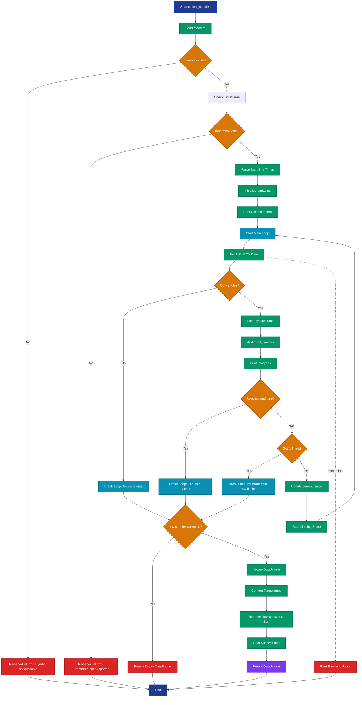

# Collect Candles Flow Diagram

This diagram shows the complete flow of the `collect_candles` method from the `CandleDataCollector` class.

## Key Decision Points

1. **Symbol Validation**: Checks if the requested symbol exists on the exchange
2. **Timeframe Validation**: Verifies the timeframe is supported by the exchange
3. **Data Availability**: Continues fetching until no more data or end time reached
4. **Rate Limiting**: Respects exchange rate limits between requests

## Loop Termination Conditions

The main fetching loop terminates when:
- ❌ No candles returned (no more data)
- ⏰ End time reached (if specified)
- 📉 Fewer candles than limit returned (last batch)

## Error Handling

- **Symbol Error**: Raises ValueError with available symbols
- **Timeframe Error**: Raises ValueError with supported timeframes  
- **Network/API Error**: Prints error and re-raises exception

## Data Processing Steps

1. **Raw Data**: OHLCV arrays from exchange
2. **DataFrame**: Convert to pandas with proper columns
3. **Timestamps**: Convert milliseconds to UTC datetime
4. **Cleanup**: Remove duplicates and sort chronologically
5. **Validation**: Ensure data integrity and completeness